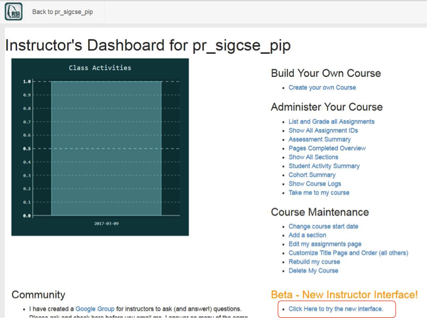

The Instructor Interface
========================

Once you are listed as the instructor for a custom course, you can access a variety of instructor features.

We are partway through a transition to a new instructor interface. Sometimes features of the old and new interfaces don't play well together, so we will use only the new, beta interface here.

1. Make sure you are logged in to a course for which you are an instructor. If necessary, click on the person icon at top right and select *Change Course* to get to a course that you are instructor for, or logout and login with a different account.

2. Click on the person icon on the upper right and select *Instructor's Page*

.. figure:: Figures/GoToInstructor.png
    :width: 800px
    :align: center
    :alt: Clicking on the instructor's page
    :figclass: align-center

    Figure 1: How to go to the instructor's page

3. Click on the link titled, *Click Here to try the new interface*

    Figure 2: How to go to the instructor's page