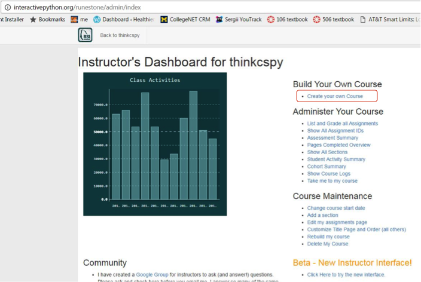
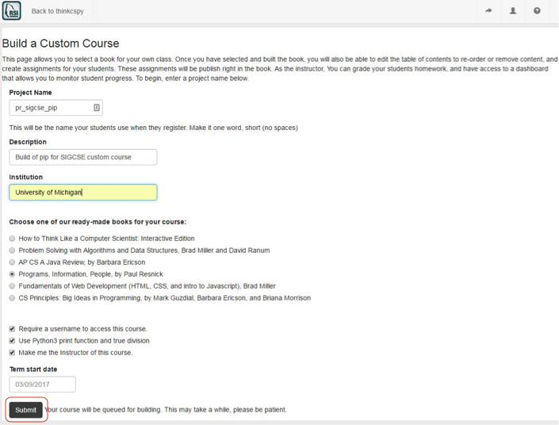
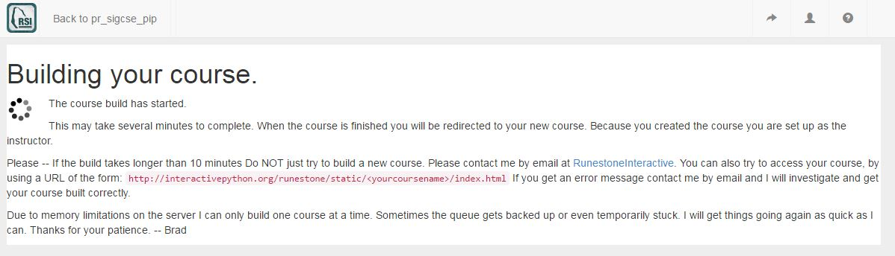

How to Create a Custom Course
-------------------------------------

1. Log in to the `runestone server <https://runestone.academy>`_. if you already have an account with Runestone Interactive.  If you don't have an account then you can create one by clicking on the following `Reg Link <https://runestone.academy/runestone/default/user/register>`_.

.. figure:: Figures/reg.png
    :width: 600px
    :align: center
    :alt: shows the login screen

    Figure 1: The login screen for Runestone Interactive

2. Select an existing course that you are already a student in, such as thinkcspy.

.. figure:: Figures/chooseCourse.png
    :width: 800px
    :align: center
    :alt: shows the login screen

    Figure 2: The choose course screen for Runestone Interactive

3. Click on the person icon on the upper right and select "Instructor's Page"

.. figure:: Figures/GoToInstructor.png
    :width: 800px
    :align: center
    :alt: Clicking on the instructor's page

    Figure 3: How to go to the instructor's page

4. On the next page, click on the Create your own Course link

    Figure 4: How to go to the Create your own Course page

5. Fill out the form and click submit. Create a unique Project name and record it. It is the name of your custom course and the course name that your students will need to register for your custom course.

    Figure 5: A filled out create a course form

6. At this point, you have to wait a while until it completes. For the SIGCSE 2017 workshop, to avoid delayes, we have pre-created a bunch of custom courses for each of the books, from a bunch of fake accounts. You can take over one of those accounts so you don't have to wait for a course to build.

    Figure 6: The page that is shown while the custom course is building

7.  Your students can register for your custom course by using the unique name that you used when you created your custom course at the following link `Registration <https://runestone.academy/runestone/default/user/register>`_..  If they already have a login on Runestone Interactive they can simply add another course.
