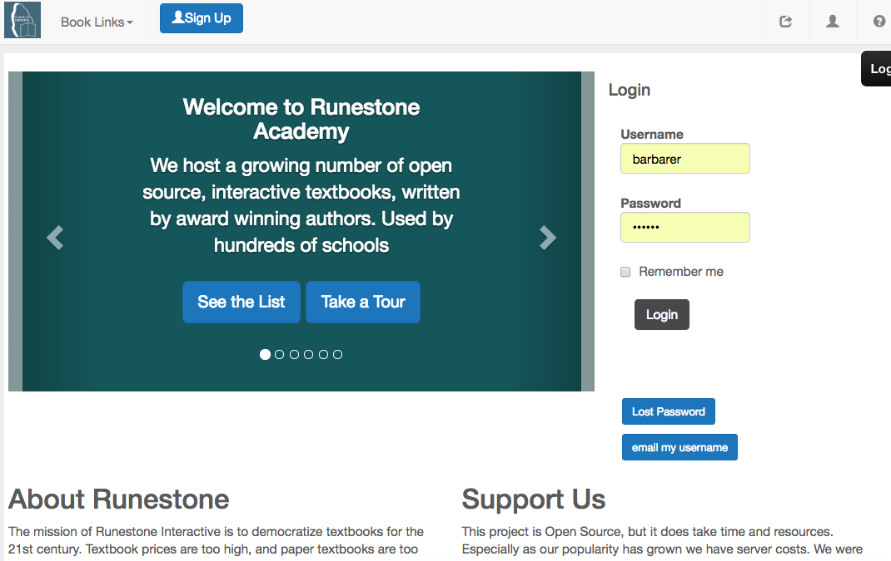
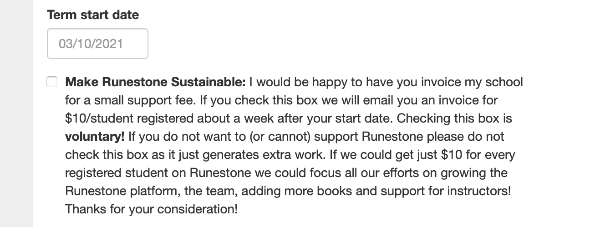
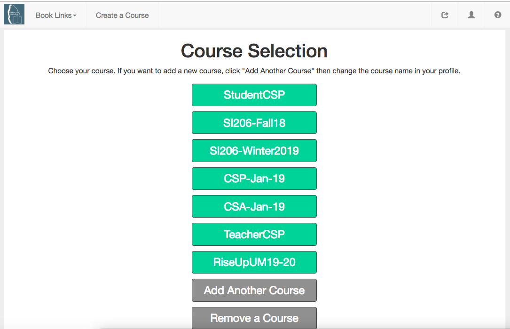

How to Create a Custom Course
-------------------------------------

.. youtube:: t78ktTWrGkc
    :divid: create_course_vid
    :align: center    

1. Log in to the runestone server at `https://runestone.academy <https://runestone.academy>`_ if you already have an account with Runestone Academy.  If you don't have an account then you can create one at `https://runestone.academy/runestone/default/user/register <https://runestone.academy/runestone/default/user/register>`_. When you register, it will ask to enter the name of an ebook.  You can enter the name for any of the existing ebooks.

    Figure 1: The login screen for Runestone Academy

2. Go to the Build a Custom Course Page at `https://runestone.academy/runestone/designer/index <https://runestone.academy/runestone/designer/index>`_.  Fill in a unique name for your course.  You may want to include a semester and year as part of the unique name.  Enter a description and the name of your institution. Scroll down and check the other options and then click "Submit".

.. figure:: Figures/customCourse.png
    :width: 600px
    :align: center
    :alt: Page to create a custom course

    Figure 2: The Build a Custom Course Page

Of special note is the checkbox just above the submit button.  This says that you would like to support Runestone at the rate of $10 / student from your department or school.  This is totally VOLUNTARY!  If you check the box you will get an invoice from us about a week after the starting date you entered for your course.  If you can't pay or do not wish to pay simply do not check the box.  It is fine either way, but we would love your support if you are able.

    Support Runestone

3. Success!

.. figure:: Figures/build_done.png
    :width: 600px
    :align: center
    :alt: Support Runestone

    Build Successful
    
The successful build page reminds you of some resources that you can use to get help.  Please do not use email.  Please check for and file problems on Github.  Many problems are duplicates and have already have workarounds or explanations.

4.  Your students can register for your custom course by using the unique name that you used when you created your custom course when they register at `https://runestone.academy/runestone/default/user/register <https://runestone.academy/runestone/default/user/register>`_..  If they already have a login on Runestone Academy, they can simply add another course using the new course name by going to `https://runestone.academy/runestone/default/courses <https://runestone.academy/runestone/default/user/register>`_. and then clicking on "Add Another Course".

    Figure 4: The page that allows the user to add another course or switch courses

We will also cover how you can pre-register your students with a CSV file in another section.
