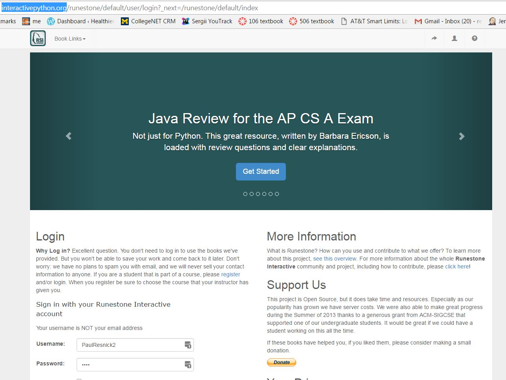
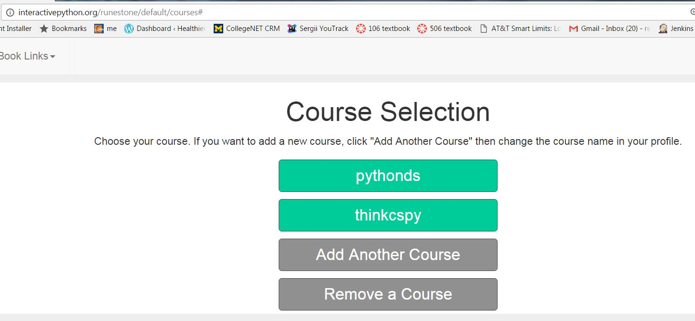
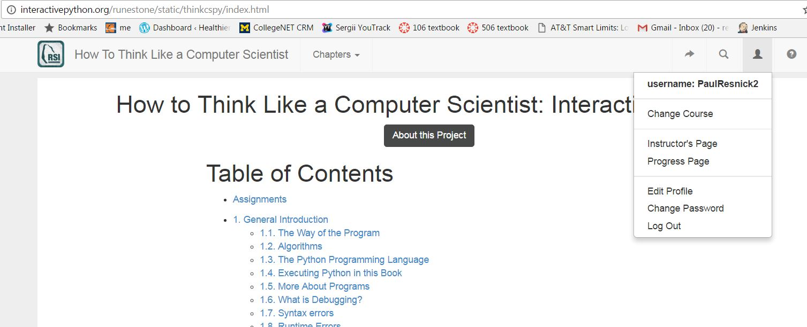
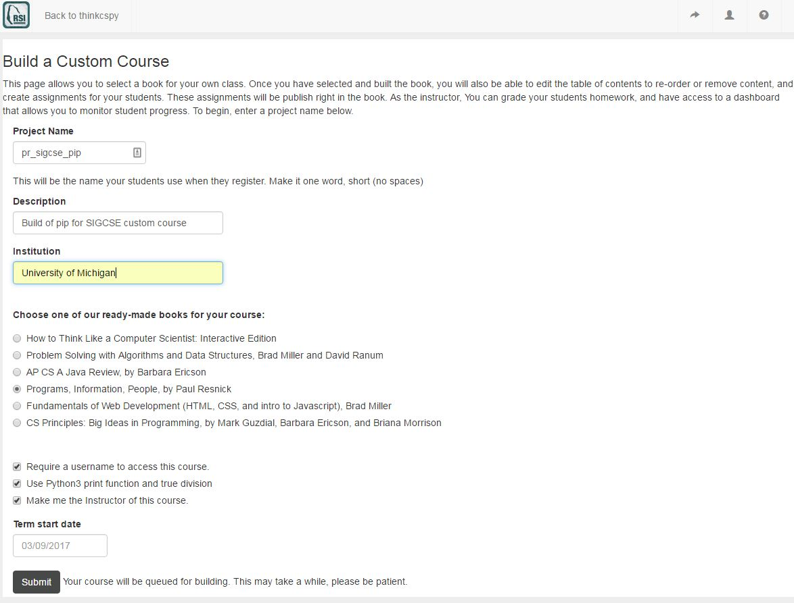

Creating the Course
-------------------

1. Log in to the `runestone server <http://interactivepython.org>`_ using the account that you already created as a student for an existing course.

2. Select an existing course that you are already a student in, such as thinkcspy.

3. Click on the person icon on the upper right and select "Instructor's Page"

4. On the next page, click on the Create your own Course link

.. image:: Figures/dashboardCreateCourse.JPG

5. Fill out the form and click submit. Remember the Project name that you use; you will need to give that text string to your students.

6. At this point, you have to wait a while until it completes. For the SIGCSE 2017 workshop, to avoid delayes, we have pre-created a bunch of custom courses for each of the books, from a bunch of fake accounts. You can take over one of those accounts so you don't have to wait for a course to build.

.. image:: Figures/waitForBuild.JPG

