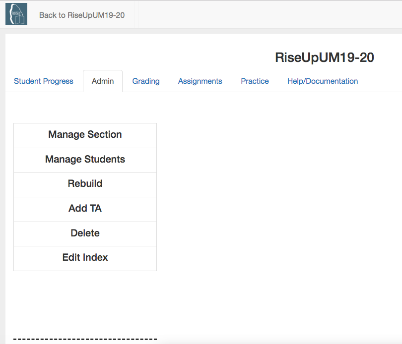

The Instructor Interface
========================

.. youtube:: oeGwKLNLI-Y
    :divid: interfaceintro
    :height: 315
    :width: 560
    :align: left

Once you are listed as the instructor for a custom course, you can access a variety of instructor features.

1. Make sure you are logged in to a course for which you are an instructor. If necessary, click on the person icon at top right and select *Change Course* to get to a course that you are instructor for, or logout and login with a different account.

2. Click on the person icon on the top right of the window and select *Instructor's Page*

.. figure:: Figures/GetToInstructor.png
    :width: 800px
    :align: center
    :alt: Clicking on the instructor's page
    :figclass: align-center

    Figure 1: How to get to the instructor's page

3.  You will see the instructor page as shown below.  You may be on a different tab that what is shown below.

    Figure 2: The Instructor's Page
