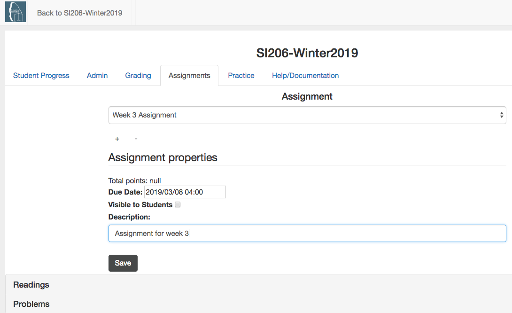
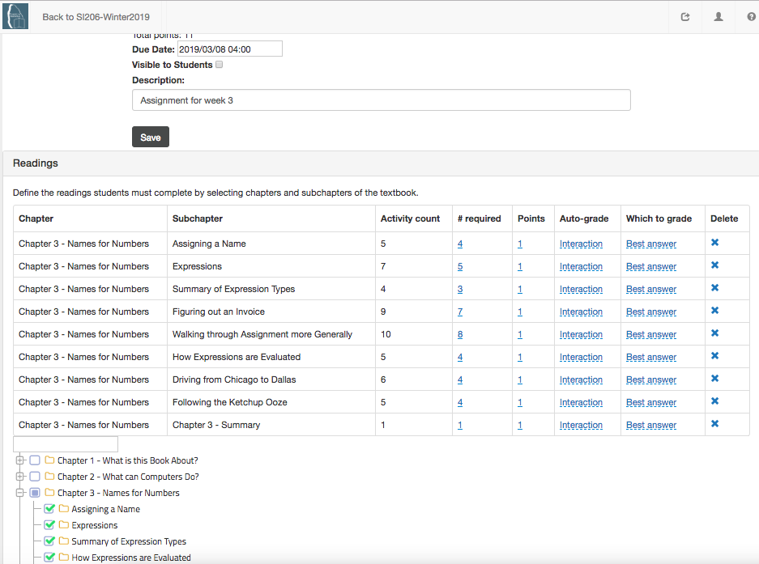

Create an Assignment
====================

1. To create an assignment, whether graded or ungraded, start by going to the Assignments tab on the instructor interface. Click on the + button to start creating a new assignment.

.. figure:: Figures/clickPlus.png
    :width: 800px
    :align: center
    :alt: Click on the plus to create a new assignment
    :figclass: align-center

    Figure 1: Click on the plus to create a new assignment

2. Provide a name for the assignment.

.. figure:: Figures/nameAssign.png
    :width: 800px
    :align: center
    :alt: Enter a unique name for the assignment
    :figclass: align-center

    Figure 2: Enter a unique name for the assignment

3. Add a description and check the other options.

    Figure 3: Add a description and check the other options

4.  Click on "Save" to save the assignment.  It will show an alert as shown below.  Click on "Ok".

.. figure:: Figures/savedAlert.png
    :width: 800px
    :align: center
    :alt: The save alert box
    :figclass: align-center

    Figure 4: The save alert box.

5.  Add readings to the assignment by clicking on the "Readings" and checking a chapter or subchapters.  You can change the number of activities the students must complete, the points, and the way the items are graded.

    Figure 5: Adding chapters or subchapters to read.

6.  You can add problems to an assignment too by clicking on "Problems" and checking problems to add in the chapters or subchapters. You can change how each problem is graded and which answer to grade.  Click on "Save" when you are done.  Be sure to make the assignment visible to students when it is complete. It will appear on the assignment page which is the first link in the table of contents.

.. figure:: Figures/addProb.png
    :width: 800px
    :align: center
    :alt: Adding problems to solve.
    :figclass: align-center

    Figure 6: Adding problems to solve.
