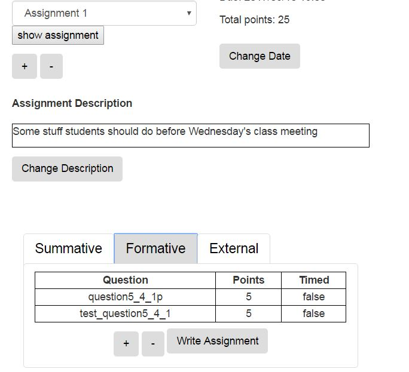

Create an Assignment
====================

1. To create an assignment, whether graded or ungraded, start by going to the Assignments tab on the instructor interface. Click on the + button to start creating a new assignment.

.. image:: Figures/assignmentsTab.JPG

2. Fill out the form.

.. image:: Figures/createAssignmentForm.JPG

3. Select an Assignment and click on Show Assignment. You should see something like this.

.. image:: Figures/bareAssignment.JPG

At this point, you can start adding activities/questions to the assignment. There are three tabs at the bottom:

* *Summative* questions are meant to assess student learning; students earn points for correct solutions. Typical examples are programming problems, multiple choice questions, or parsons problems (mixed-up code).

* *Formative* questions or activities are meant to give students an opportunity to learn; students earn points for doing the activities, regardless of whether they get them right or not.

* *External* activities are things that students do outside of the Runestone website, such as reading an article on an external site; this activity is not tracked and students can not earn points from them.

Later in this workshop, you will learn how to author your own activities. At this point, we will only assemble activities that are already in the Question Bank. Each textbook comes with its own built-in Question Bank.

Let's add a few questions to our assignment.

1. Click on Summative

2. Click on the + sign. The right side will populate with a form for setting search criteria. The term field lets you perform text search. The Chapter dropdown lets you select exercises from within a particular chapter. Click the search button to find all the activities that meet the criteria you've specified. In this example, we've searched for questions from the Functions chapter that include the term "iteration"; four were found.

.. image:: Figures/questionSearch.JPG

3. If you select a question and scroll down, you will see the markup for the question. Eventually, the "Preview" button will show you what the activity will look like for a student, but it has not been implemented yet. Set how many points you want to give the assignment and click on the Add to Assignment button.

.. image:: Figures/questionAssign.JPG

4. You can repeat this process for additional questions, and add Formative questions as well.

.. image:: Figures/summativePopulated.JPG

5. When you are satisfied with the set of activities, click on the writeAssignment button. You won't get any feedback (sorry about that) but a file will be written on the server so that the next time you "rebuild" the course, the new assignment will be visible.

6. Click back to the Admin tab on the instructor interface. Then click Rebuild.

.. image:: Figures/rebuild.JPG

7. Finally, scroll down and, on the right hand side, click "Rebuild Now". Then wait (scroll down to see a progress indicator

.. image:: Figures/rebuildNow.JPG

8. When the rebuild is finished, you will be redirected the table of contents for your course. Click on the link the assignments page, and you will see a link to the assignment you just created.

.. image:: Figures/assignmentsPage.JPG

.. image:: Figures/assignment1.JPG

