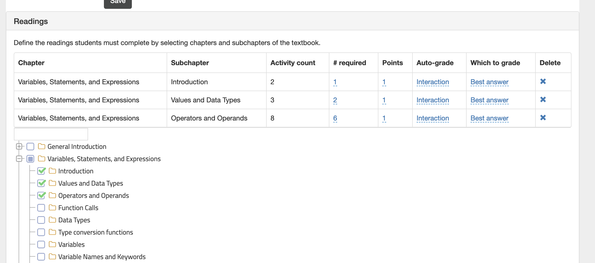
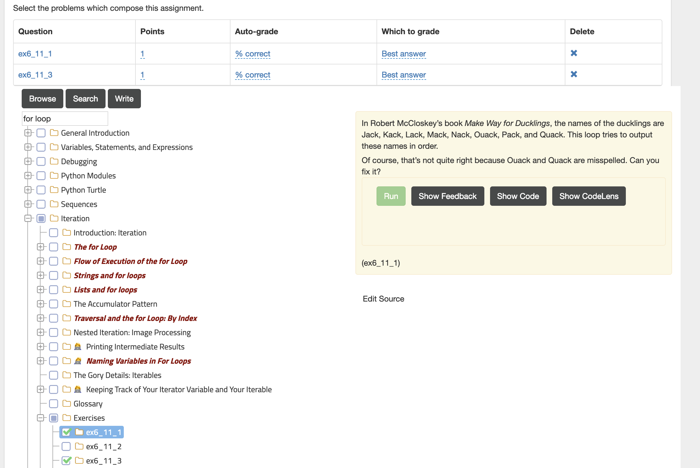

Create an Assignment
====================

.. youtube:: h45c7_wIgGA
    :height: 315
    :width: 560
    :align: left

1. To create an assignment, whether graded or ungraded, start by going to the Assignments tab on the instructor interface. Click on the Add button to start creating a new assignment.

.. figure:: Figures/assignmentMain.png
    :width: 800px
    :align: center
    :alt: Click on the plus to create a new assignment
    :figclass: align-center

    Figure 1: Click on the Add button to create a new assignment

2. Provide a name for the assignment.

.. figure:: Figures/nameAssign.png
    :width: 800px
    :align: center
    :alt: Enter a unique name for the assignment
    :figclass: align-center

    Figure 2: Enter a unique name for the assignment

3. Add a description and check the other options.

4.  Click on "Save" to save the assignment.  It will show an alert as shown below.  Click on "Ok".

.. figure:: Figures/savedAlert.png
    :width: 800px
    :align: center
    :alt: The save alert box
    :figclass: align-center

    Figure 4: The save alert box.

There are two primary kinds of assignments.  **Reading Assignments** and **Problems.**   Reading assignments allow you to select whole chapters or parts of chapters for your students to read.  You can assign points to the reading assignment by tracking the number of activities they attempt in each subchapter.    Problem assignments are mainly for you to select short programming problems for the students to solve, but could also include short answer, multiple choice, etc.  Or even problems that you write yourself.  More on that later.

In either case the primary way you will add questions is through the tree picker interface

.. image:: Figures/tree_picker.png

Creating a Reading Assignment
-----------------------------

Let's create a reading assignment and add a few sections for our students to read.  As you add sections you will see that are shown in a table under the Readings tab.

There are four things you can change for each section:

* # required - How many of the components on the page do you students need to do in order to get the points for this section.

* How many points for completing this section?

* Auto-grade - interaction means that the students have done something

* which to grade - first answer, best answer, or last answer

Creating a Problem Assignment
-----------------------------

Creating a problem assignment is similar.  You will most often use the tree picker, but you can also search for problems or write your own.   When selecting a problem if you click on the name of the problem the interface will display the problem on the page remind you what it is about.

Problems have a different set of configurations

* Points - how many points for this question

* Auto-grade -- options here are % correct, All or nothing, Interaction, or manual.

* which to grade -- Best Answer, first answer or last answer

Problems with the book icon next to them are written by the author.  Problems with the schoolhouse are contributed by the community.  If a problem has a checkmark next to it then you know it can be automatically graded.

