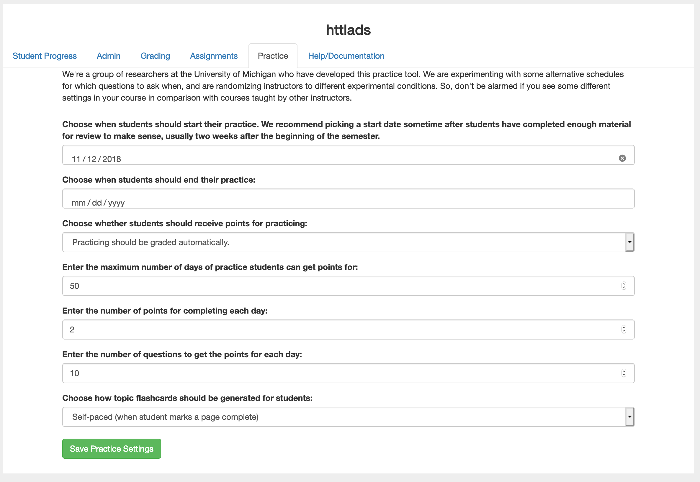

The Practice Interface
======================

How often have you had a student ask you how they could get more practice?  One theory that supports this is "spaced repetition"  That is, a method to have students go back and answer existing questions but a couple of weeks after the material was brand new.  Its harder, because its now out of the immediate context of the reading they just did, but this type of review helps solidify a student's understanding of the concept.

There is a paper about this in the ACM Digital Library from the 2019 proceedings.  Speed and Studying: Gendered Pathways to Success, Iman Yeckehzaare and Paul Resnick.

This feature is available in Foundations of Python Programming, and How to Think Like a Computer Scientist.  The exercises need to be tagged and in some cases categorized.  Other books will follow as we do the work to update the source.

    Set up the practice feature for your course.

Once you have enabled the practice feature for the course, you enable the sections you want practice questions to come from.

.. figure:: Figures/practice_choose.png

The students see the practice feature like this:

.. figure:: Figures/practice_student.png

