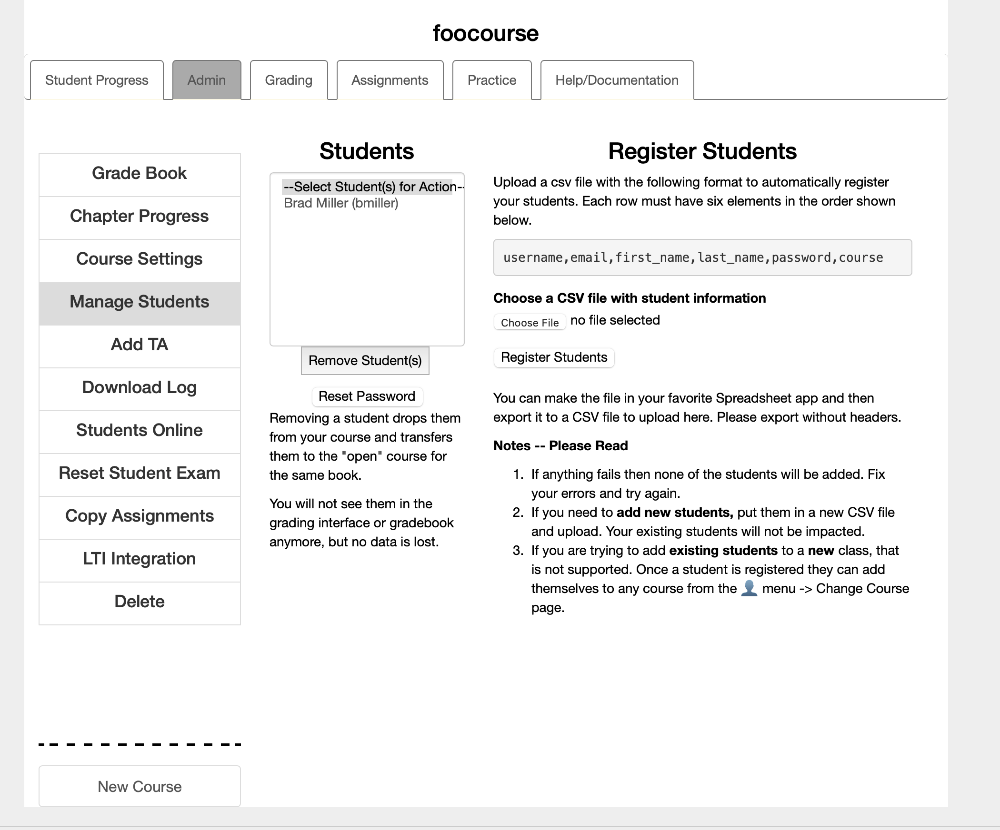

.. _student_reg_chap:

Adding Students to your Course
==============================

.. youtube:: RJ-bYYjKbTU
    :divid: register_vid
    :align: center

When you created the custom course, you chose a project name. Give that text string to students. They will register on the site and enter that string as their course name. If you've forgotten what the string is, you can see it displayed on the Course selection page `<https://runestone.academy/runestone/default/courses>`_.  You can access that page by clicking on the person icon at the top right of the window and then selecting *Change Course*.

.. note:: Students will register for a custom course following the same procedures that were described :ref:`earlier in this book <registration_chap>`. You just need to provide them with the text string for the course name.

You can also pre-register your students by creating a CSV file and uploading that file through the instructor interface.  Pull down the 👤 menu and Choose Instructor Page then click on the button for Manage Students.  You will see a page like this:

    
    Register your Students
    
You can create a csv file in your favorite spreadsheet program and exporting or you can simply edit a textfile, whatever works for you.  The format of the file MUST be as shown in the figure.

::

    username,email,first_name,last_name,password,course
    user1,user@school.com,Jane,Smith,xxxx,foocourse
    

Notice -- There are no spaces after the commas. Excel is horrible at exporting it will add extra blank fields and lines that look like ``,,,,,,,,`` Once you export from excel its best to clean things up in your favorite text editor.

When the file is created you can choose it and upload it to Runestone.  It will verify the fields and if there are no errors it will register the students.  The most common error is that the username is a duplicate.  Usernames are the primary way we identify students and they must be unique.  With over 120,000 students in the database there are bound to be duplicates.  This is not a bug, it is a sign of growth.

If you add students to your class later you need to create a new CSV file just for them (or have them register themselves).  Adding students to the end of your previous spreadsheet will result in lots of error messages about duplicate usernames.

Removing Students
=================

If a student drops your course, you can remove them from this same page.  Simply highlight their name in the list, and click the Remove Student(s) button.  It is important to note that removing a student from your class does not delete them.  They are simply moved to the open course that is available to anyone.  That way if they decide to come back to the material on their own they haven't lost any work.

Resetting Passwords
===================

We all forget our password occasionally.  Normally resetting a password can be done on Runestone by simply using our password reset button on the homepage.  However, some schools do not allow their students to receive ANY external email on their school email address. Some schools have crazy systems that want someone to answer a riddle before they accept that the email is for real.  I don't have time to answer riddles to please IT administrators. 