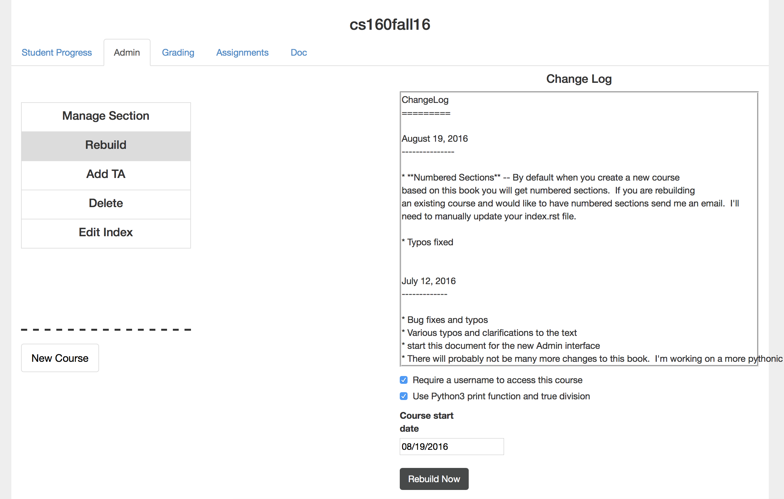

Editing the Table of Contents
=============================

To edit the TOC of your book you can use the instructor interface.

1.  From the main page of the instructors interface (Beta) click the edit index button.  This will change the view to include a text area containing the restructuredText for the index.   The ``.. toctree::`` directive organizes the book.  Every book must have at least one toctree directive.  However you will see that most of the Runestone books have a toctree directive for every chapter.

.. image:: Figures/mainpage.png

2.  You can now edit the restructuredText in the text area provided.  When you are done click the submit button.  In general the format for the toctree entries is simply an ordered list of paths to rst files.  In the Runestone books each chapter is in its own folder and each section is in a file in that folder. 

.. image:: Figures/editToc.png

During the last development cycle we added the ability to have numbered sections.  This had the unfortunate side effect of moving most of the table of contents management to a separate file for each chapter, which unfortunately, is not available for you to edit.   However if you are willing to forgo section numbers you can have full control over what sections you want to include by moving the bulk of the work back into the main index file.   You will need to look at the source for the book your are using to understand which files are in which chapter.  This is all

3.  The final step is to rebuild your book. By clicking on Rebuild and then the Rebuild Now buttons.

As you have already learned, the build process is a bit slow, due to our hardware configuration.   A development goal for the future will be to make previewing and checking the syntax for a single directive much quicker.
